# 系统用户手册框架
## 目录
1. 引言
   - 项目名称
   - 版本与日期
   - 目标读者
   - 主要功能概览
2. 系统概述
   - 运行环境要求
   - 访问地址
   - 演示账号
3. 学生端使用手册
   - 概述
   - 登录与进入系统
   - 学生首页与导航
   - 我的岗位（My Jobs）
   - 个人资料与附件管理
   - AI 工作建议器
   - 通知中心
   - 常见操作步骤
   - 常见问题
4. 教学组织者端使用手册
   - 概述
   - 登录与角色入口
   - 我的招聘需求
   - 申请审核与录用
   - 发布与管理岗位
   - 导出与报告
   - 常见问题
5. 管理员端使用手册
   - 概述
   - 登录与后台入口
   - 用户管理
   - 任务与工作量设置
   - 系统设置
   - 报表导出
   - 常见问题
6. 附录
   - 术语说明
   - 系统约束

---

## 1. Introduction

### 1.1 Project name

Teaching Assistant Recruitment System.

### 1.2 Target audience

- This manual is intended for end users of the system: students (applicants), teaching organisers (MO), and system administrators.
- It can also be used by developers and operations personnel as a quick reference for usage and demo accounts.

### 1.3 Key features 

- Student: browse and filter available jobs, submit/withdraw applications, manage profile and attachments, view hired job schedules, use the AI Job Advisor.
- Teaching Organiser (MO): post job demands, manage recruitment and review applications, export job and application reports.
- Administrator: user and permission management, system configuration, monitoring, and report export.

## 2. System Overview

### 2.1 System Requirements

The following environment is recommended for running the system:

- Java Runtime Environment (JRE/JDK) — recommended version 21
- Maven build tool (for project building and testing)
- Servlet container or application server (e.g. Tomcat 9+)
- Modern web browser with JavaScript enabled:
  - Google Chrome
  - Microsoft Edge
  - Mozilla Firefox

### 2.2 Access URL

After deployment, open a web browser and visit the following address:

```text
http://localhost:8080/web/
```

> Note: In production environments, the host name or context path may differ depending on deployment settings.

### 2.3 Login and Account Access

Users can log into the system using their assigned account credentials.

After successful login, the system automatically redirects users to the corresponding portal based on their account role.

The system currently supports the following user roles:

- Student
- Teaching Organiser (MO)
- Administrator

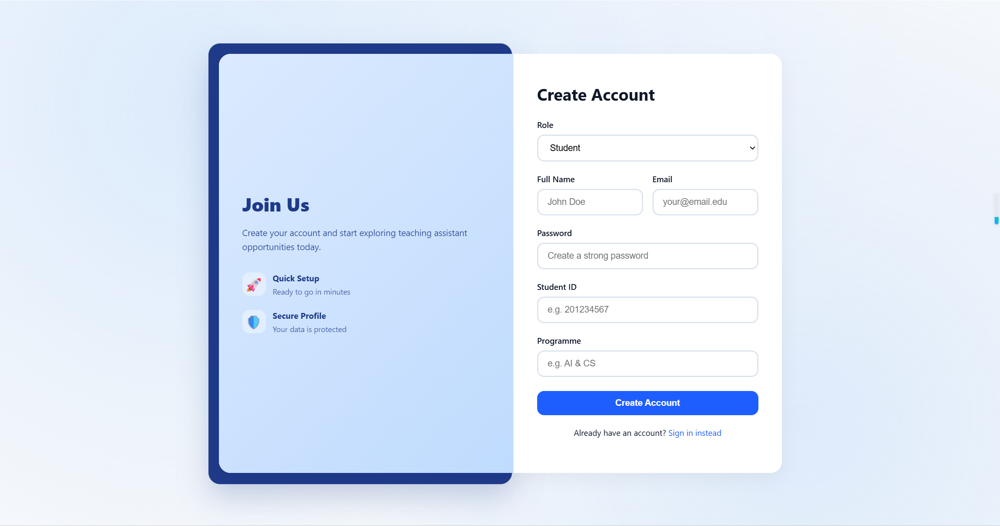
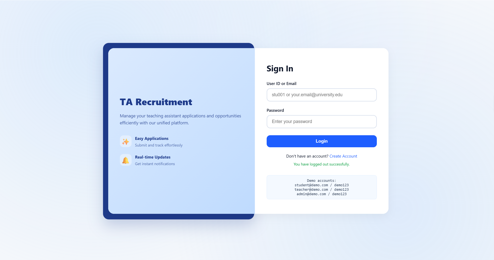

### 2.4 Demo Accounts

The system includes several demo accounts for testing and demonstration purposes.

| Role | Email | Password |
|---|---|---|
| Student | `student@demo.com` | `demo123` |
| Teacher | `teacher@demo.com` | `demo123` |
| Administrator | `admin@demo.com` | `demo123` |

## 3 Student User Guide

### 3.1 Overview

The student module allows applicants to browse available TA positions, manage applications, receive hiring updates, and organize their accepted jobs through a unified interface.

Main functions include:

- Viewing and filtering available jobs
- Checking skill matching results
- Using the AI Job Advisor
- Submitting and withdrawing applications
- Tracking application status
- Viewing hired job schedules
- Managing profile information and attachments
- Updating account password

### 3.2 Available Jobs

The **Available Jobs** page displays all currently open TA positions.

Students can browse available positions and search for suitable jobs using multiple filters.

#### 3.2.1 Available Filters

Students may filter jobs based on:

- Course name
- Lecturer / teacher name
- Skill requirements
- Schedule time
- Job status
- Workload

The filtering system helps students quickly locate positions that match their interests and availability.

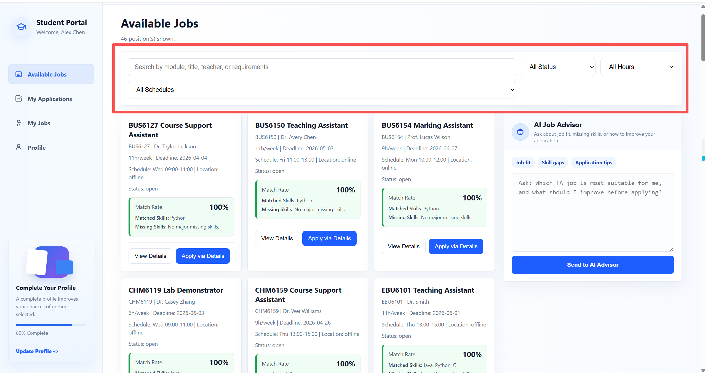

#### 3.2.2 Viewing Job Details

Each job includes a **View Details** option.

The details page may include:

- Course information
- Position number
- Required skills
- Weekly workload
- Schedule information
- Recruitment status
- Deadline
- Skill Match Breakdown

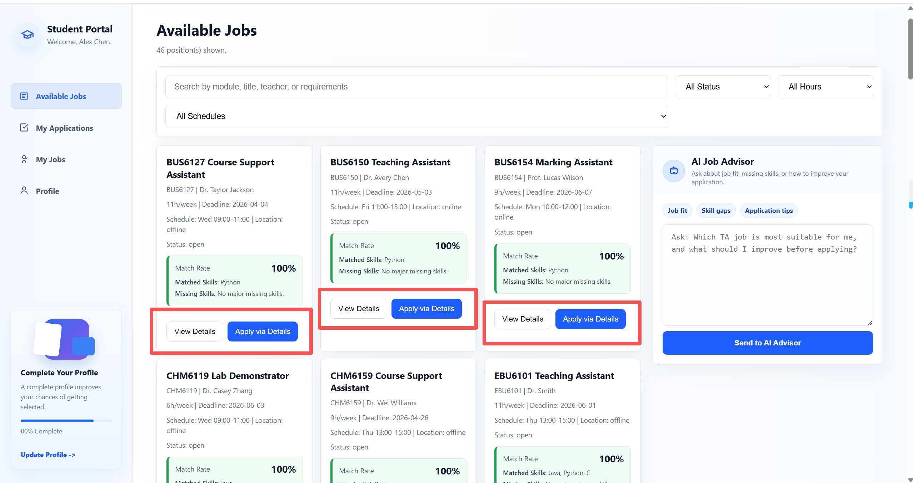
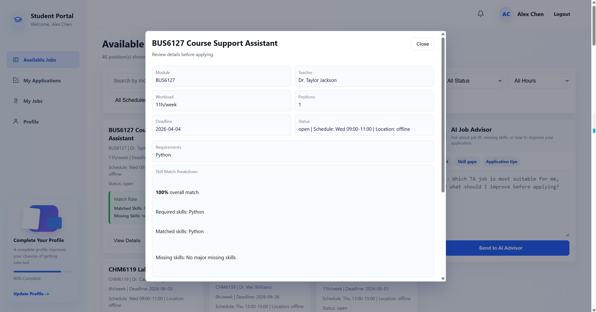

#### 3.2.3 Skill Matching

For each job, the system displays a skill matching result between the student's profile and the job requirements.

The matching feature helps students understand:

- Which required skills are already satisfied
- Which skills are currently missing
- Overall suitability for the position

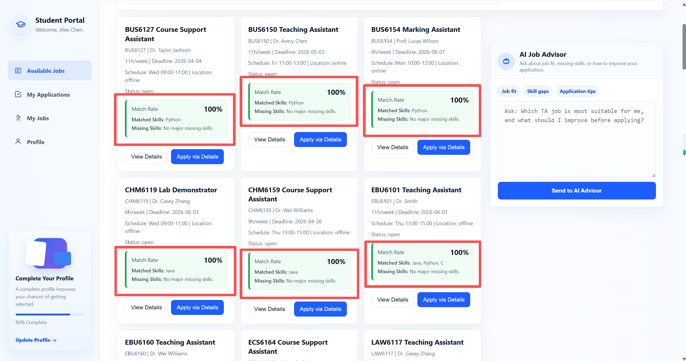

#### 3.2.4 AI Job Advisor

The AI Job Advisor provides AI-assisted recommendations and job-related suggestions.

Students may ask questions such as:

- “Which TA positions are suitable for me?”
- “Why does this course have a low match score?”
- “What skills should I improve?”
- “Recommend jobs based on my profile.”

The AI system combines rule-based matching logic with AI-generated explanations.

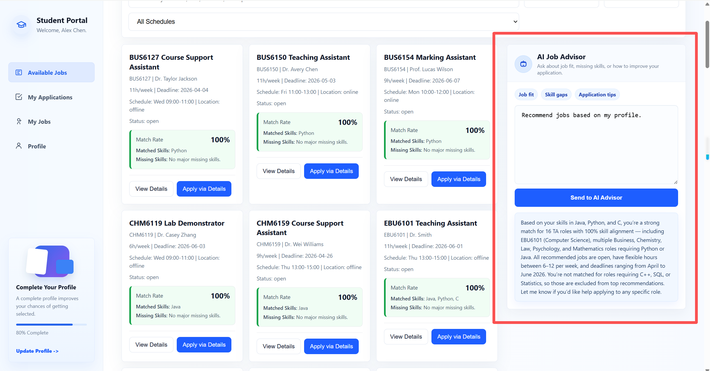

#### 3.2.5 Applying for a Job

To apply for a position:

1. Open the desired job listing.
2. Click the **Apply** button.
3. Select an existing attachment or upload a new resume.
4. Confirm and submit the application.

After submission, the application status can be tracked through the **My Applications** page.

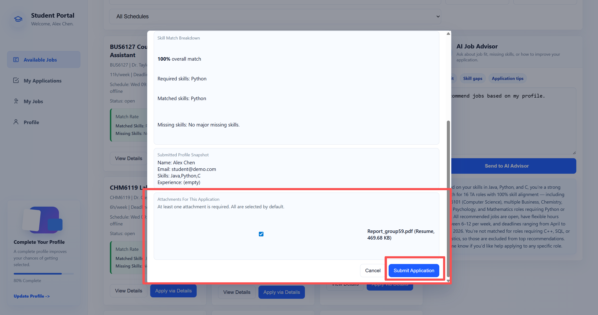

### 3.3 My Applications

The **My Applications** page allows students to track all submitted applications.

Each application includes a status indicator:

- `Under Review`
- `Hired`
- `Rejected`

Students may also view:

- Applied course information
- Submission date
- feedback
- Recruitment progress
  
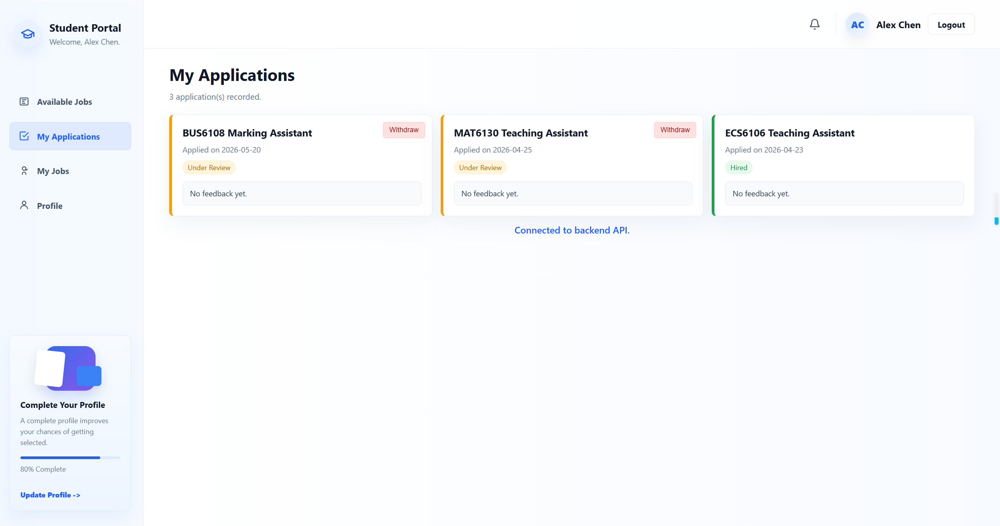

#### 3.3.1 Withdrawing an Application

Applications that are still under review may be withdrawn.

##### Steps

1. Open the **My Applications** page.
2. Locate the target application.
3. Click the **Withdraw** button.
4. Confirm the operation.

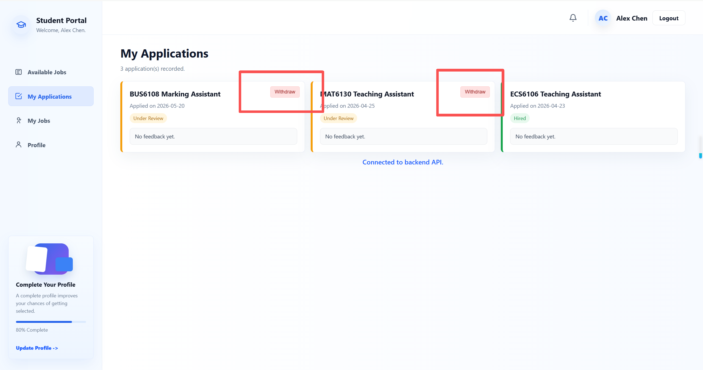

### 3.4 My Jobs

The **My Jobs** page displays all jobs for which the student has been hired.

Students can view:

- Accepted TA positions
- Working schedules
- Course-related task plans
- Daily activity arrangements

A calendar view is provided to help students manage work schedules more efficiently.

Highlighted dates indicate assigned TA activities or planned work sessions.

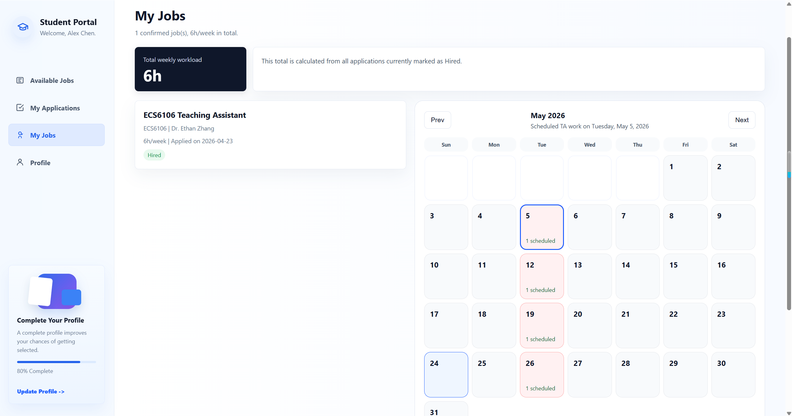

### 3.5 Profile Management

The **Profile** page allows students to manage personal information and supporting documents.

Students may:

- Edit profile information
- Upload resumes or transcripts
- Manage attachments
- Update passwords

#### 3.5.1 Resume and Attachment Upload

The system supports two types of profile information.

##### 3.5.1.1 Structured Information

Students may manually complete profile fields such as:

- Name
- Student ID
- Contact information
- Skills
- Experience

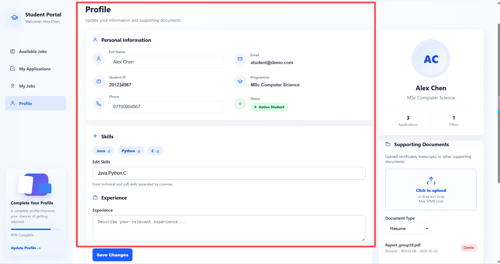

##### 3.5.1.2 File Upload

Students may also upload supporting files, including:

- Resume / CV
- Transcript
- Certificates

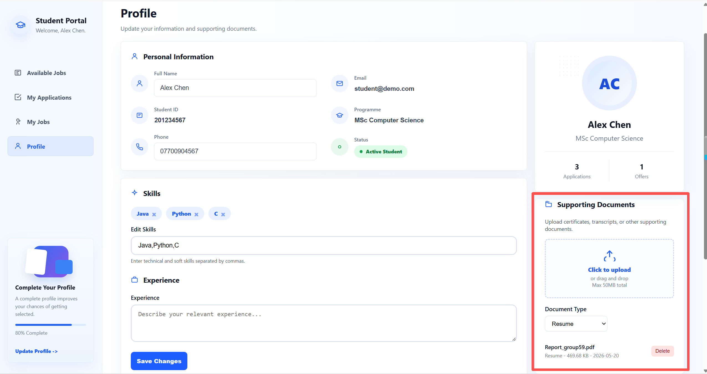

#### 3.5.2 Changing Password

Students can update their account password through the Profile page.

##### Steps

1. Open the **Profile** page.
2. Select **Change Password**.
3. Enter the current password.
4. Enter and confirm the new password.
5. Save the changes.

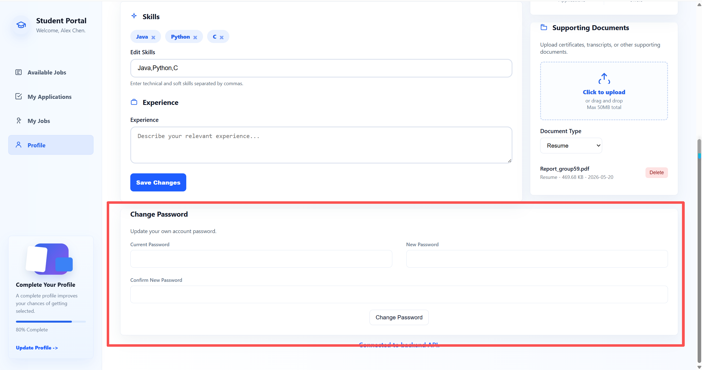

## 5. Administrator Portal User Manual

### 5.1 Overview

This chapter is intended for system administrators. The administrator portal provides system-level management functions for the Teaching Assistant Recruitment System.

Administrators can:

- View the overall recruitment status
- Manage user accounts
- Review TA demand submissions
- Monitor student workload
- View and filter TA job records
- Export recruitment and workload reports
- Send system announcements
- Change their own password
  
### 5.2 Administrator Homepage and Navigation

The administrator homepage provides access to the main management modules:

- System Overview
- Workload
- Users
- Demand Review
- Jobs
- Announcements
- My Account

The administrator can switch between these sections using the navigation bar.


## 9. 附录：术语说明

- **岗位**：系统发布的助教职位。
- **已申请**：学生已提交申请但尚未录用。
- **已录用**：学生已被录取并分配岗位。
- **附件**：上传的简历或证明材料。
- **AI 建议器**：系统中的智能建议模块。
- **通知中心**：接收系统消息和岗位通知的模块。

