# 系统用户手册框架
## 目录
1. 引言
   - 项目名称
   - 版本与日期
   - 目标读者
   - 主要功能概览
2. 系统概述
   - 运行环境要求
   - 访问地址
   - 演示账号
3. 学生端使用手册
   - 概述
   - 登录与进入系统
   - 学生首页与导航
   - 我的岗位（My Jobs）
   - 个人资料与附件管理
   - AI 工作建议器
   - 通知中心
   - 常见操作步骤
   - 常见问题
4. 教学组织者端使用手册
   - 概述
   - 登录与角色入口
   - 我的招聘需求
   - 申请审核与录用
   - 发布与管理岗位
   - 导出与报告
   - 常见问题
5. 管理员端使用手册
   - 概述
   - 登录与后台入口
   - 用户管理
   - 任务与工作量设置
   - 系统设置
   - 报表导出
   - 常见问题
6. 附录
   - 术语说明
   - 系统约束

---

## 1. Introduction

### 1.1 Project name

Teaching Assistant Recruitment System.

### 1.2 Target audience

- This manual is intended for end users of the system: students (applicants), teaching organisers (MO), and system administrators.
- It can also be used by developers and operations personnel as a quick reference for usage and demo accounts.

### 1.3 Key features 

- Student: browse and filter available jobs, submit/withdraw applications, manage profile and attachments, view hired job schedules, use the AI Job Advisor.
- Teaching Organiser (MO): post job demands, manage recruitment and review applications, export job and application reports.
- Administrator: user and permission management, system configuration, monitoring, and report export.

## 2. System Overview

### 2.1 System Requirements

The following environment is recommended for running the system:

- Java Runtime Environment (JRE/JDK) — recommended version 21
- Maven build tool (for project building and testing)
- Servlet container or application server (e.g. Tomcat 9+)
- Modern web browser with JavaScript enabled:
  - Google Chrome
  - Microsoft Edge
  - Mozilla Firefox

### 2.2 Access URL

After deployment, open a web browser and visit the following address:

```text
http://localhost:8080/web/
```

> Note: In production environments, the host name or context path may differ depending on deployment settings.

### 2.3 Login and Account Access

Users can log into the system using their assigned account credentials.

After successful login, the system automatically redirects users to the corresponding portal based on their account role.

The system currently supports the following user roles:

- Student
- Teaching Organiser (MO)
- Administrator


### 2.4 Demo Accounts

The system includes several demo accounts for testing and demonstration purposes.

| Role | Email | Password |
|---|---|---|
| Student | `student@demo.com` | `demo123` |
| Teacher | `teacher@demo.com` | `demo123` |
| Administrator | `admin@demo.com` | `demo123` |

## 3 Student User Guide

### 3.1 Overview

The student module allows applicants to browse available TA positions, manage applications, receive hiring updates, and organize their accepted jobs through a unified interface.

Main functions include:

- Viewing and filtering available jobs
- Checking skill matching results
- Using the AI Job Advisor
- Submitting and withdrawing applications
- Tracking application status
- Viewing hired job schedules
- Managing profile information and attachments
- Updating account password

### 3.2 Available Jobs

The **Available Jobs** page displays all currently open TA positions.

Students can browse available positions and search for suitable jobs using multiple filters.

#### 3.2.1 Available Filters

Students may filter jobs based on:

- Course name
- Lecturer / teacher name
- Skill requirements
- Schedule time
- Job status
- Workload

The filtering system helps students quickly locate positions that match their interests and availability.


#### 3.2.2 Viewing Job Details

Each job includes a **View Details** option.

The details page may include:

- Course information
- Position number
- Required skills
- Weekly workload
- Schedule information
- Recruitment status
- Deadline
- Skill Match Breakdown


#### 3.2.3 Skill Matching

For each job, the system displays a skill matching result between the student's profile and the job requirements.

The matching feature helps students understand:

- Which required skills are already satisfied
- Which skills are currently missing
- Overall suitability for the position


#### 3.2.4 AI Job Advisor

The AI Job Advisor provides AI-assisted recommendations and job-related suggestions.

Students may ask questions such as:

- “Which TA positions are suitable for me?”
- “Why does this course have a low match score?”
- “What skills should I improve?”
- “Recommend jobs based on my profile.”

The AI system combines rule-based matching logic with AI-generated explanations.


#### 3.2.5 Applying for a Job

To apply for a position:

1. Open the desired job listing.
2. Click the **Apply** button.
3. Select an existing attachment or upload a new resume.
4. Confirm and submit the application.

After submission, the application status can be tracked through the **My Applications** page.


### 3.3 My Applications

The **My Applications** page allows students to track all submitted applications.

Each application includes a status indicator:

- `Under Review`
- `Hired`
- `Rejected`

Students may also view:

- Applied course information
- Submission date
- feedback
- Recruitment progress
  


#### 3.3.1 Withdrawing an Application

Applications that are still under review may be withdrawn.

##### Steps

1. Open the **My Applications** page.
2. Locate the target application.
3. Click the **Withdraw** button.
4. Confirm the operation.


### 3.4 My Jobs

The **My Jobs** page displays all jobs for which the student has been hired.

Students can view:

- Accepted TA positions
- Working schedules
- Course-related task plans
- Daily activity arrangements

A calendar view is provided to help students manage work schedules more efficiently.

Highlighted dates indicate assigned TA activities or planned work sessions.


### 3.5 Profile Management

The **Profile** page allows students to manage personal information and supporting documents.

Students may:

- Edit profile information
- Upload resumes or transcripts
- Manage attachments
- Update passwords

#### 3.5.1 Resume and Attachment Upload

The system supports two types of profile information.

##### 3.5.1.1 Structured Information

Students may manually complete profile fields such as:

- Name
- Student ID
- Contact information
- Skills
- Experience


##### 3.5.1.2 File Upload

Students may also upload supporting files, including:

- Resume / CV
- Transcript
- Certificates


#### 3.5.2 Changing Password

Students can update their account password through the Profile page.

##### Steps

1. Open the **Profile** page.
2. Select **Change Password**.
3. Enter the current password.
4. Enter and confirm the new password.
5. Save the changes.


## 4. Teacher (Module Organiser) User Manual

### 4.1 Overview

This chapter is intended for Module Organiser (MO) users. The MO portal supports the main teaching assistant recruitment workflow, including submitting TA demands, publishing approved jobs, reviewing applicants, completing final hiring, receiving notifications, and managing account information.

MO users can:

- Submit TA recruitment demands
- Publish jobs after Admin approval
- View and manage applicants
- Shortlist, reject, or hire applicants
- Export applicant data
- Receive recruitment notifications
- Change their own password

---

### 4.2 Portal Navigation

The MO portal contains three main sections:

- **My Jobs**: Submit demands, publish jobs, and view job history
- **Applicants**: Review applications and make hiring decisions
- **Profile**: View account information and change password

The current page is highlighted in the left navigation bar.

---

### 4.3 My Jobs

The **My Jobs** page is the main workspace for managing TA recruitment tasks.

It includes:

- Workflow summary cards
- Submit New Demand form
- My Demand Progress list
- Job History table

#### 4.3.1 Submit a New Demand

To submit a new TA demand:

1. Open the **My Jobs** page.
2. Fill in the course name, department, planned TA count, expected working hours, and demand notes.
3. Click **Submit Demand**.
4. The demand will be sent to Admin for approval.

After submission, the demand enters the pending review stage.

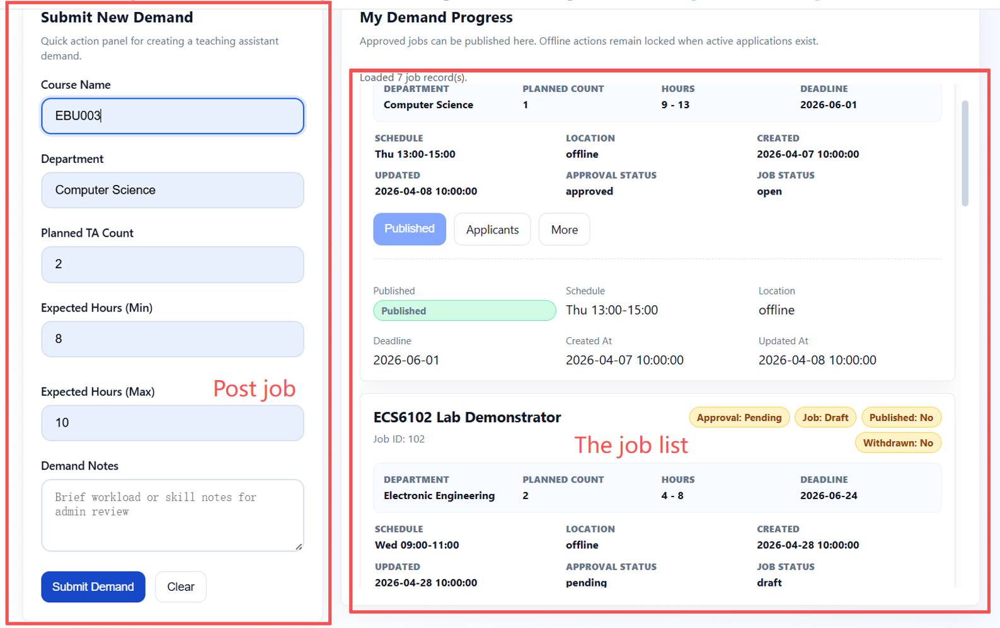

#### 4.3.2 Demand Status

A demand may have the following statuses:

- **Pending**: Waiting for Admin approval
- **Approved**: Approved by Admin and ready to publish
- **Rejected**: Rejected by Admin
- **Published**: Visible to students
- **Withdrawn**: Taken offline
- **Closed**: Recruitment has been completed

Only approved demands can be published as TA jobs.

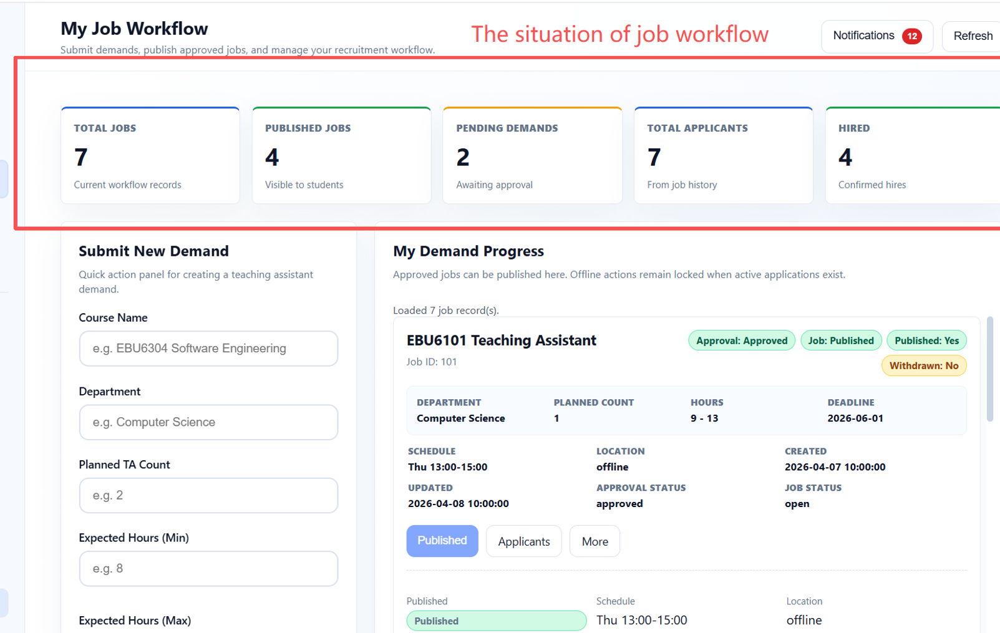

#### 4.3.3 Publish a Job

After a demand is approved by Admin, the MO can publish it.

Operation steps:

1. Find the approved demand.
2. Click **Publish**.
3. Enter the location, schedule, deadline, and job requirements.
4. Confirm publication.

After publication, students can view and apply for the job.

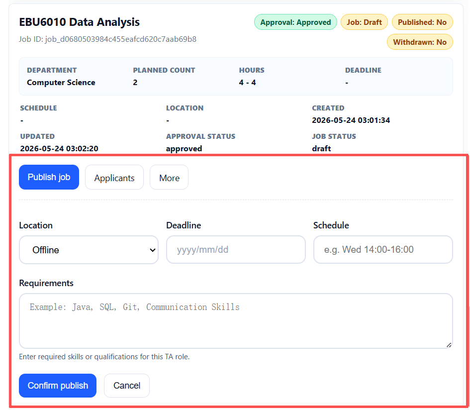

#### 4.3.4 Edit, Delete, or Withdraw a Demand

MO users can manage demands according to their current status.

- Unpublished demands can be edited or deleted.
- Published jobs must be taken offline before editing.
- Closed jobs cannot be edited directly.
- Edited demands must be reviewed by Admin again.

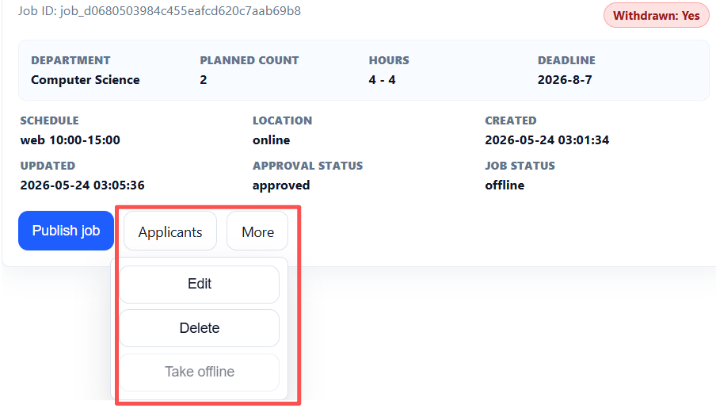

#### 4.3.5 Job History

The Job History table shows previously published jobs.

It may include:

- Job title
- Status
- Number of applicants
- Number of hired students
- Release time
- Deadline
- Available actions

MO users can view job details, reuse old job information, and export applicant data.

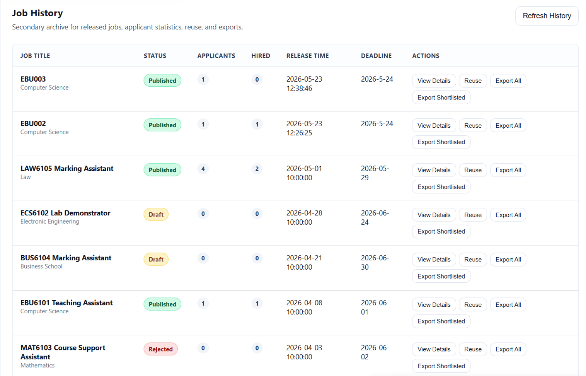

---

### 4.4 Applicants

The **Applicants** page is used to review and manage student applications.

MO users can:

- View applicant cards
- Filter applications by status
- Search applicants by name, student number, or skills
- Sort applicants by application time, match score, or workload risk
- Change application status
- Add evaluation notes and decision feedback
- Complete final hiring

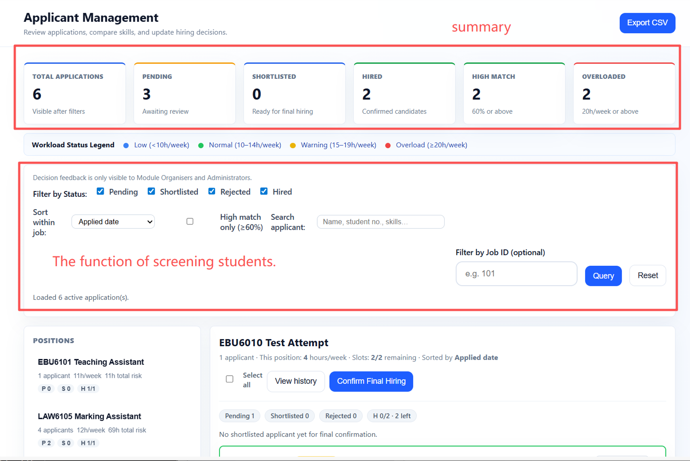

#### 4.4.1 Applicant Information

Each applicant card usually shows:

- Student name and ID
- Major
- Application time
- Skill match score
- Matched and missing skills
- Current workload level
- Application status
- Evaluation notes
- Decision feedback

The skill match score helps MO users compare applicant skills with job requirements.

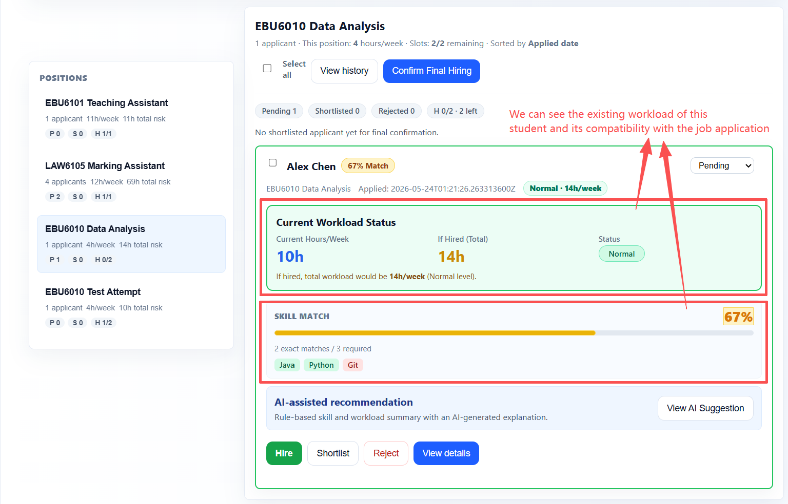
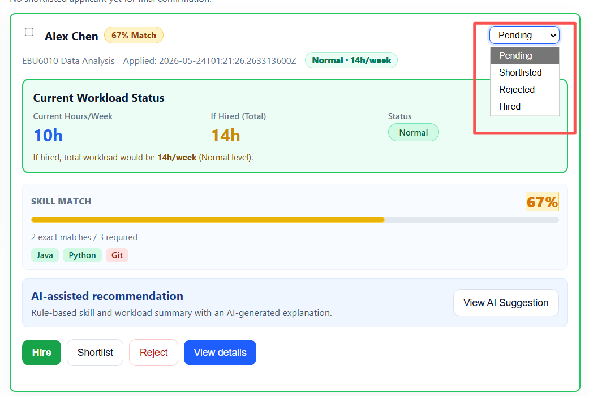

#### 4.4.2 Application Status Management

MO users can update application status according to the review result.

Common statuses include:

- **Pending**: Application has not been reviewed
- **Viewed**: Application details have been opened
- **Shortlisted**: Applicant is selected as a candidate
- **Rejected**: Applicant is not selected
- **Hired**: Applicant is finally hired

MO users can also select multiple applicants and apply batch actions.

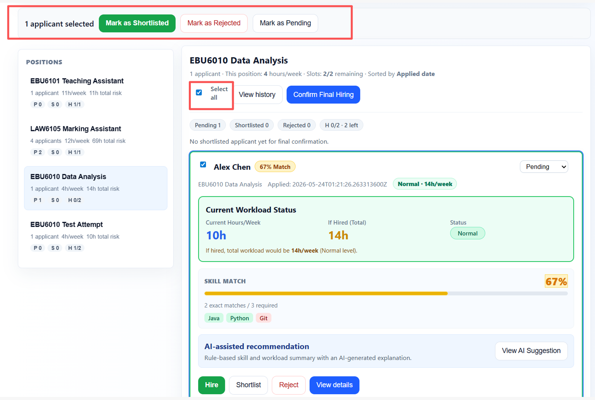

#### 4.4.3 Final Hiring

Final Hiring is used to complete the recruitment process for a job.

Operation steps:

1. Review all applications.
2. Mark suitable applicants as **Shortlisted**.
3. Open the **Final Hiring** dialog.
4. Select the final hired applicants.
5. Click **Confirm & Submit**.

After final hiring:

- Selected applicants become **Hired**.
- Other shortlisted applicants become **Rejected**.
- The job is marked as closed.
- Hired students receive notifications.
- Admin receives recruitment completion information.

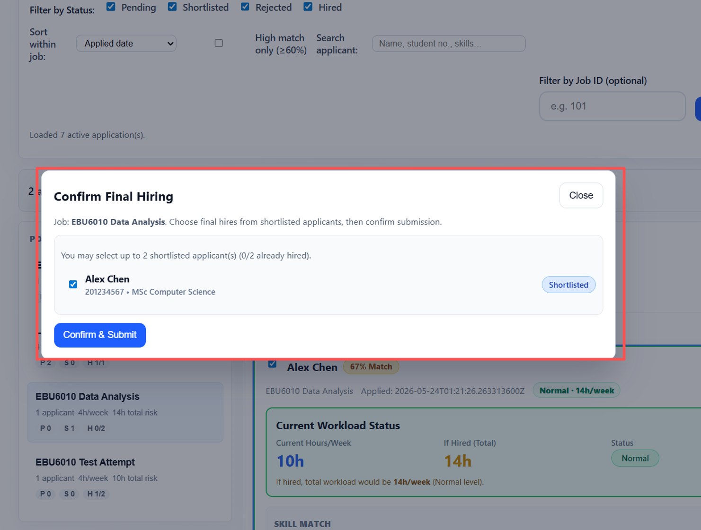

#### 4.4.4 Export Applicant Data

MO users can export applicant data from the Applicants page or Job History details.

Exported data may include:

- All applicants
- Shortlisted applicants
- Filtered application results

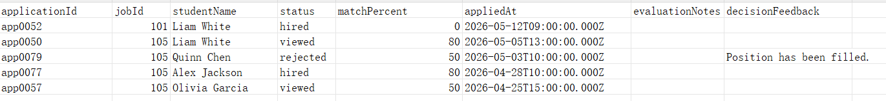
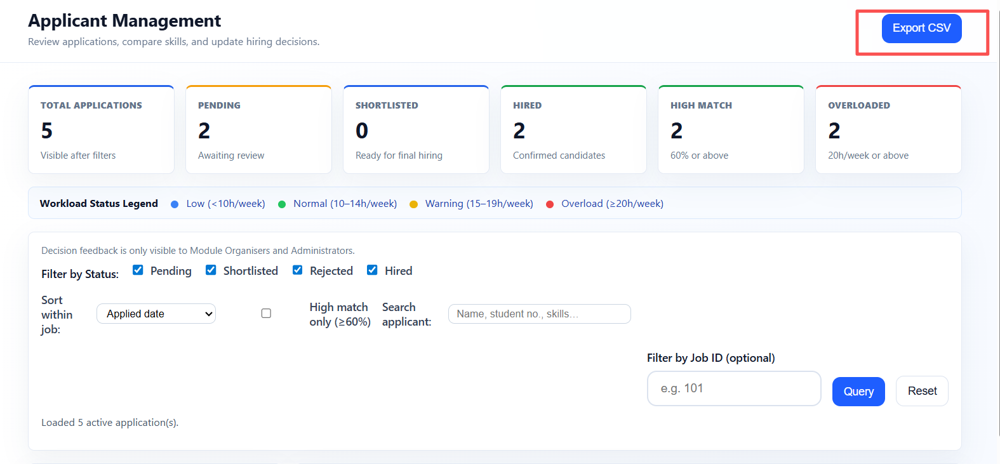

#### 4.4.5 Reject Applications

MO users can reject applications that are not matching and give feedback to students.

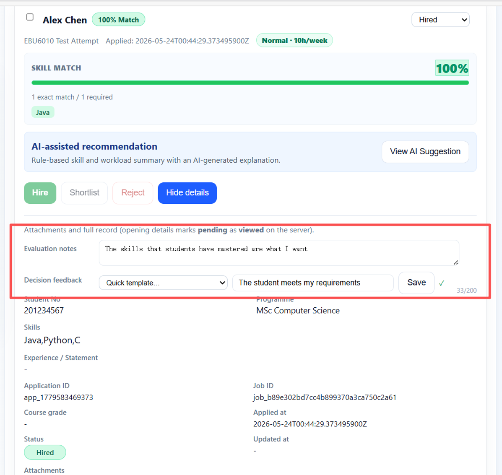

---

### 4.5 Notifications

MO users can open the notification panel to view recruitment-related messages.

Notifications may include:

- New student applications
- Admin approval or rejection results
- System announcements
- Recruitment workflow updates

Unread notifications are marked with a red dot. Clicking a notification marks it as read.

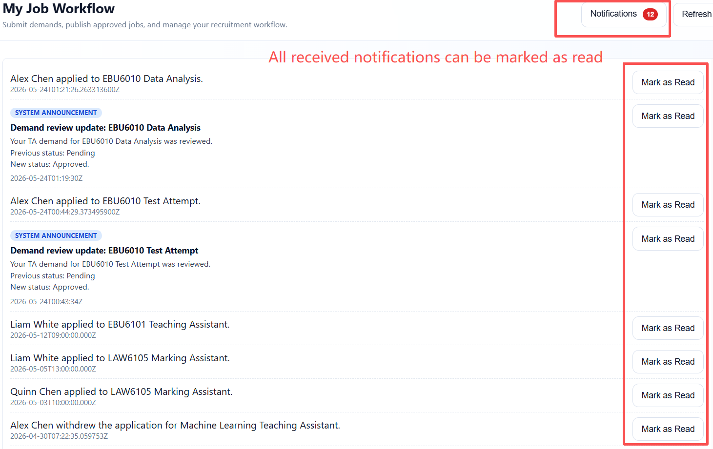

---

### 4.6 Profile

The **Profile** page shows the MO user's account information, including name, email, and role.

MO users can also change their password.

Operation steps:

1. Open the **Profile** page.
2. Enter the current password.
3. Enter the new password.
4. Confirm the new password.
5. Click **Change Password**.

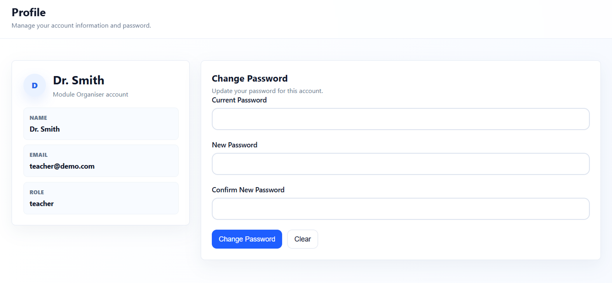

### 4.7 AI-Assisted Recommendation

The **View AI Suggestion** button on each applicant card provides an AI-assisted recommendation based on skill match and estimated workload. The system assigns a recommendation level (e.g., **Highly Recommended**, **Recommended**) with a brief explanation for reference only and does not replace the final hiring decision. If the AI service is unavailable, a system-generated explanation will be shown automatically.

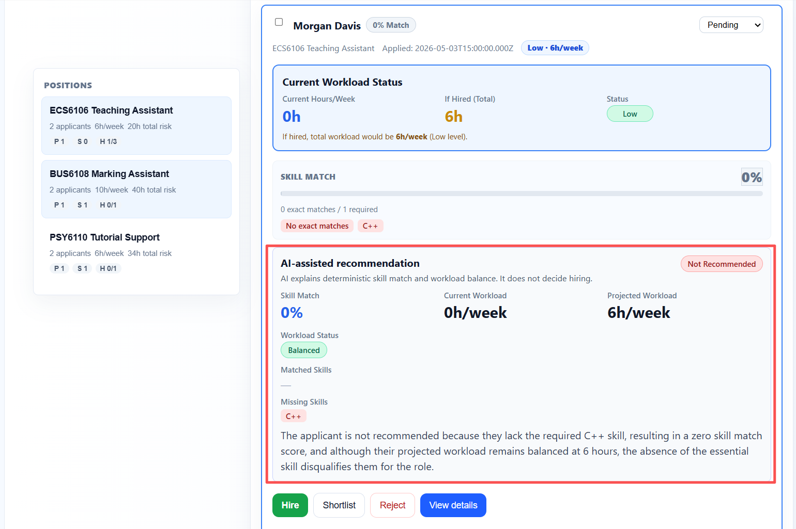

---

## 5. Administrator Portal User Manual

### 5.1 Overview

This chapter is intended for system administrators. The administrator portal provides system-level management functions for the Teaching Assistant Recruitment System.

Administrators can:

- View the overall recruitment status
- Manage user accounts
- Review TA demand submissions
- Monitor student workload
- View and filter TA job records
- Export recruitment and workload reports
- Send system announcements
- Change their own password
  
### 5.2 Administrator Homepage and Navigation

The administrator homepage provides access to the main management modules:

- System Overview
- Workload
- Users
- Demand Review
- Jobs
- Announcements
- My Account

The administrator can switch between these sections using the navigation bar.

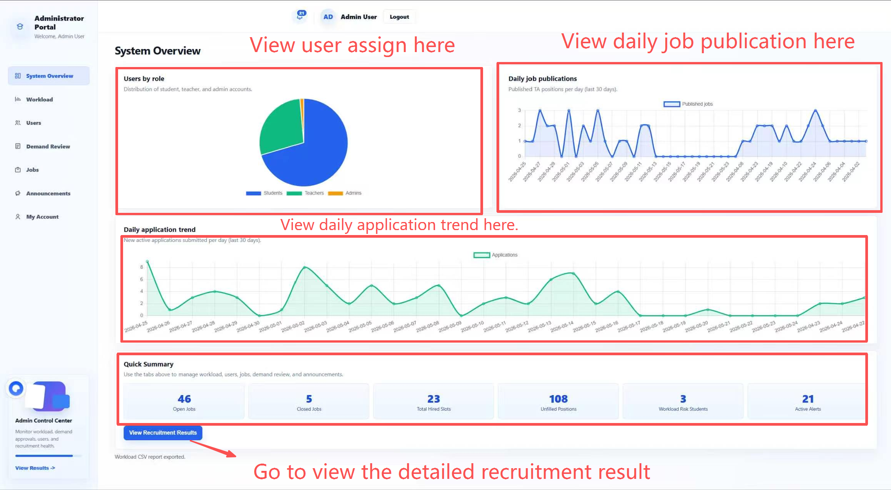

### 5.3 User Management

The User Management page allows administrators to create, search, reset, and delete user accounts.

Administrators can manage three types of users:

- Students
- Teachers / Module Organisers
- Administrators

Main operations:

1. Open the **Users** page.
2. Search for an existing user by name, email, role, or ID.
3. Create a new user by entering the required information.
4. Reset a user's password when needed.
5. Delete invalid or unnecessary accounts.

Notes:

- Student accounts require Student ID and Programme information.
- The current administrator cannot delete their own account.
- The system must keep at least one administrator account.

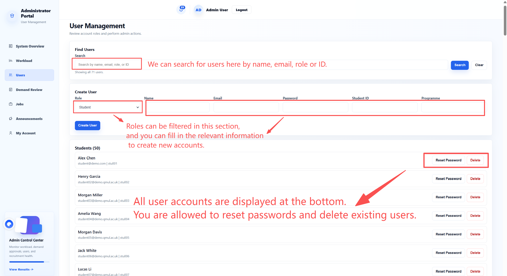

### 5.4 Workload Management

The Workload page helps administrators monitor students who have been hired for TA positions.

The system calculates each student's weekly workload based on hired TA jobs. Administrators can set a workload threshold to identify students who may be overloaded.

Main operations:

1. Open the **Workload** page.
2. Set the workload threshold.
3. Check students' weekly working hours.
4. View detailed assigned jobs.
5. Notify overloaded students if necessary.
6. Export workload reports in CSV or TXT format.

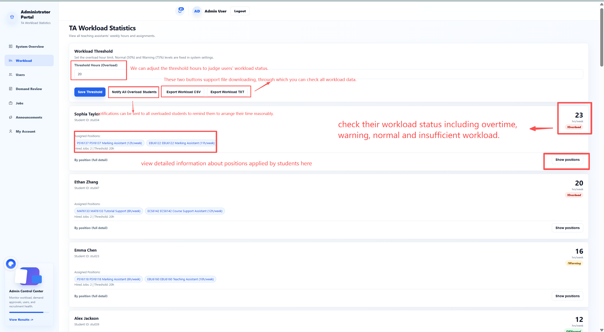

### 5.5 Demand Review

The Demand Review page is used to review TA demand submissions from Module Organisers.

Administrators can:

- View pending TA demands
- Approve valid demands
- Reject unsuitable demands
- Reset demands to pending status if needed

Operation steps:

1. Open the **Demand Review** page.
2. Select a demand from the list.
3. Review the module code, job title, organiser, planned TA count, and hour requirements.
4. Choose `approved`, `rejected`, or `pending`.
5. Save the review result.

Only approved demands can be published as TA job postings by Module Organisers.

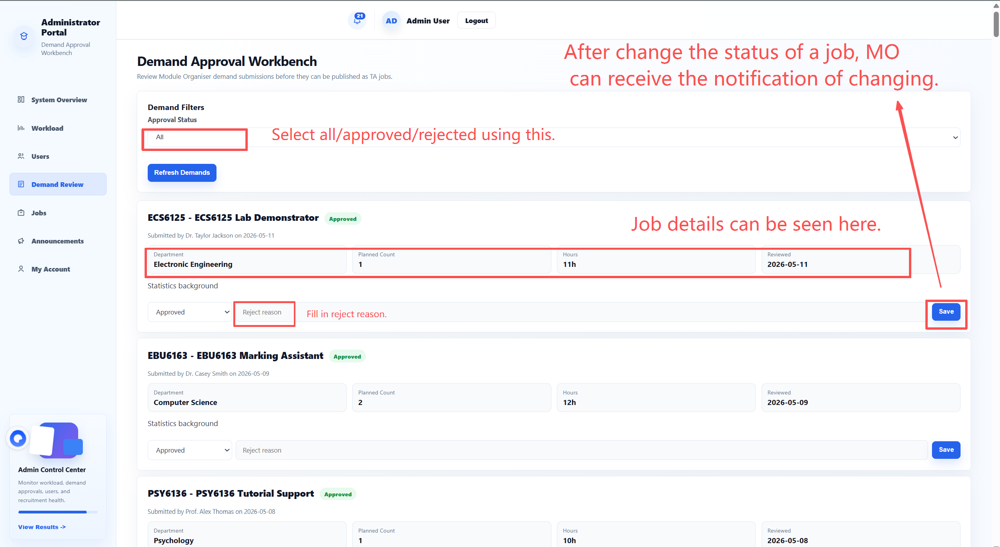

### 5.6 Job Management and Recruitment Results

The Jobs page allows administrators to view and monitor TA job postings across the system.

Administrators can:

- Filter jobs by status, department, or organiser
- View job details
- Inspect application records in read-only mode
- Reopen closed recruitment when necessary
- Export job and application reports

The Recruitment Results page provides a summary of the overall hiring outcome, including total applications, hired students, vacancies, and department-level recruitment status.
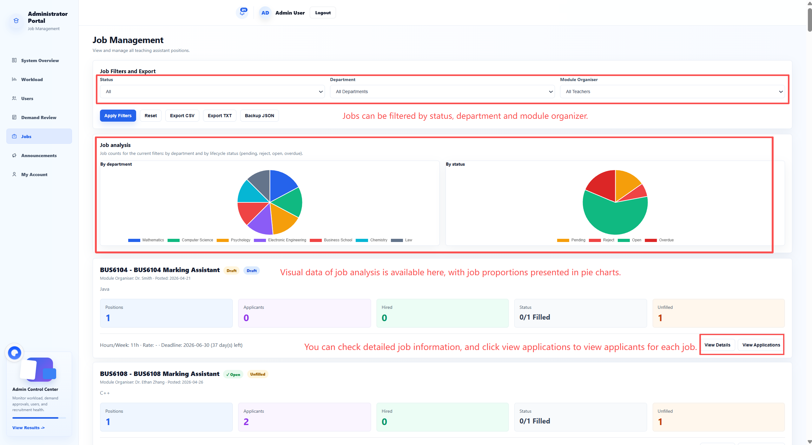
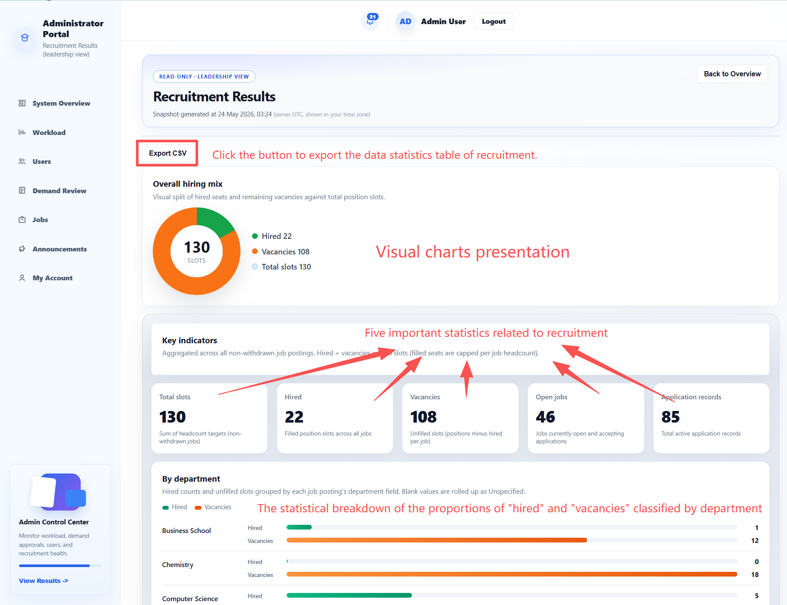

### 5.7 System Announcements

The Announcements page allows administrators to send messages to system users.

Administrators can send announcements to:

- Students
- Module Organisers
- All users

Operation steps:

1. Open the **Announcements** page.
2. Enter the announcement title.
3. Enter the announcement content.
4. Select the target user group.
5. Click **Send announcement**.
   
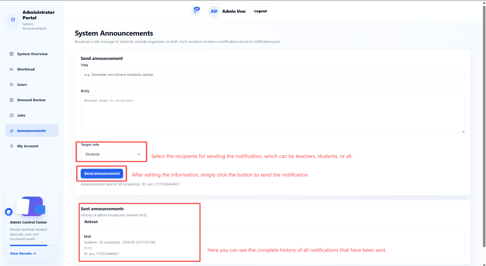

### 5.8 My Account

The My Account page allows the current administrator to change their own password.

Operation steps:

1. Open the **My Account** page.
2. Enter the current password.
3. Enter the new password.
4. Confirm the new password.
5. Click **Change Password**.
   
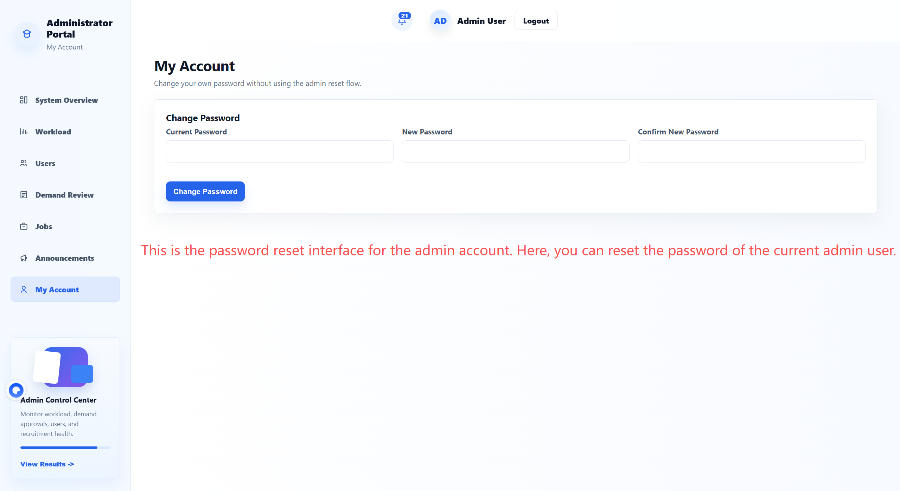

### 5.9 Report Export

Administrators can export recruitment and workload data for offline review and reporting.

Available export functions include:

- Recruitment report export
- Workload report export
- Job application report export
- Recruitment results export

Operation steps:

1. Open the relevant management page.
2. Apply filters if necessary.
3. Click the export button.
4. Save the downloaded CSV or TXT file.

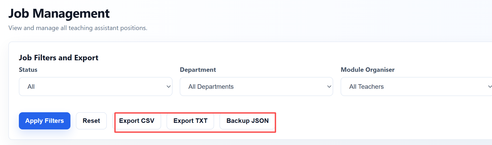

## 9. 附录：术语说明

- **岗位**：系统发布的助教职位。
- **已申请**：学生已提交申请但尚未录用。
- **已录用**：学生已被录取并分配岗位。
- **附件**：上传的简历或证明材料。
- **AI 建议器**：系统中的智能建议模块。
- **通知中心**：接收系统消息和岗位通知的模块。

